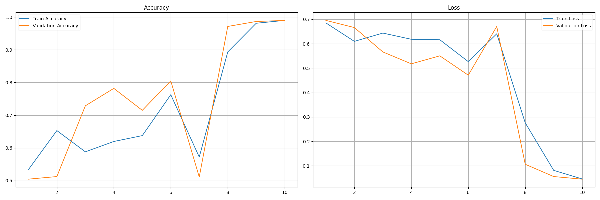
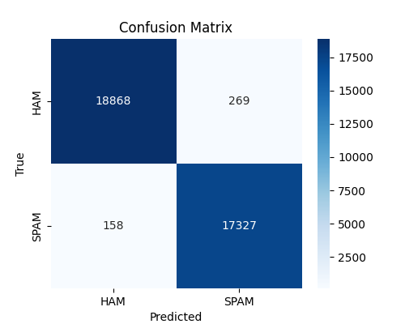
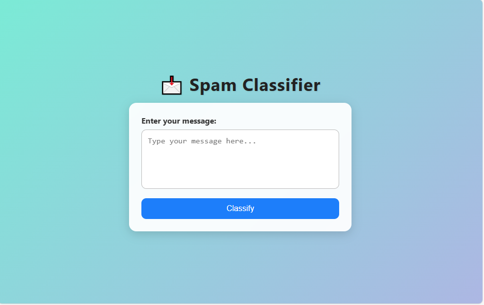
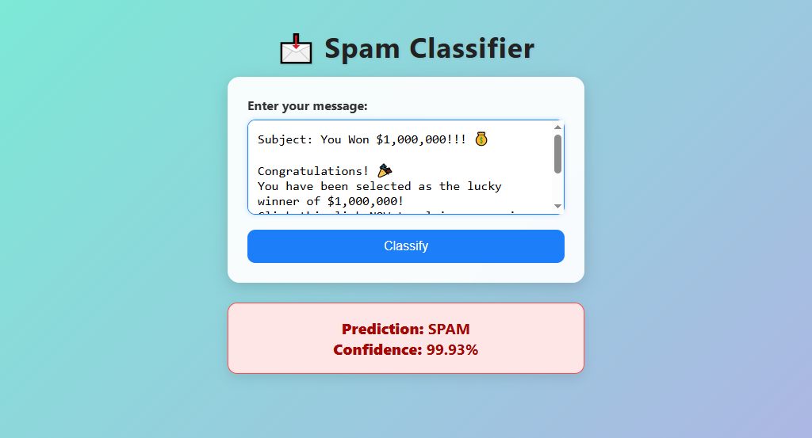
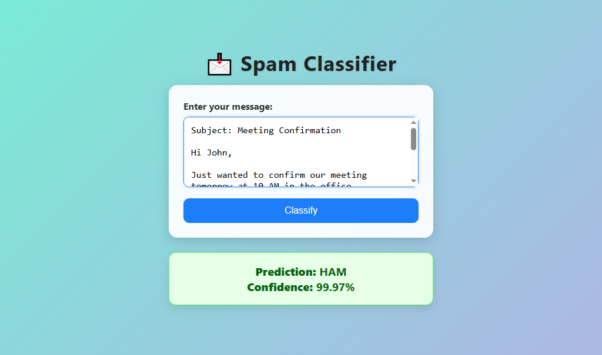

# 📩 Spam Classifier 

A professional **web application** built with **Flask** and **TensorFlow** to classify text messages as **SPAM** or **HAM** with very high accuracy.  
The project includes a trained deep learning model and an easy-to-use web interface for real-time predictions.

> 📖 **License**: Licensed under the [MIT License](#-license)

---

## 💡 Overview

This system analyzes input text messages and classifies them into:

- **SPAM** (unwanted/advertising messages)
- **HAM** (legitimate messages)

It is designed for researchers, developers, and organizations to quickly test and deploy spam detection functionality.

---

## 🎯 Model Performance

| Metric                 | Value    |
|------------------------|----------|
| **Training Accuracy**  | 99.44%   |
| **Validation Accuracy**| 98.99%   |
| **Testing Accuracy**   | 98.83%   |
| **Epochs**             | 10       |
| **Architecture**       | LSTM + Embedding |
| **Max Sequence Length**| 800 tokens |
| **Optimizer**          | Adam |
| **Loss Function**      | Categorical Crossentropy |

---

## 📈 Accuracy & Loss Curves

  

These plots show the training and validation performance of the spam classifier model over time.

---

## 📊 Confusion Matrix

  

The confusion matrix summarizes classification results across both classes.

---

## 🧾 Classification Report

**Classes**: HAM, SPAM

```
               precision    recall  f1-score   support

        HAM       0.99      0.99      0.99     19137
       SPAM       0.98      0.99      0.99     17485

   accuracy                           0.99     36622
  macro avg       0.99      0.99      0.99     36622
weighted avg      0.99      0.99      0.99     36622

```

---

## 🏗 Model Architecture

- **Embedding Layer** for word representation  
- **LSTM Layer** for sequence learning  
- **Dropout Regularization** to avoid overfitting  
- **Dense Layer** with Softmax for binary classification  
- **Tokenizer & Label Encoder** saved for reproducibility  

---

## 🌐 Web Interface

The application provides:

- A **modern, responsive interface** to input text messages  
- **Instant predictions** of SPAM or HAM  
- **Confidence score** for each classification  
- An API endpoint to integrate with other applications  

 

---

## 🧪 Example Predictions

**SPAM Example**  
  

**HAM Example**  
  

---

## ▶ How to Run

### 1️⃣ Clone the Repository

```bash
git clone https://github.com/HoussemBouagal/spam-classifier.git
cd spam-classifier
```

### 2️⃣ Create Virtual Environment & Install Dependencies

```bash
python -m venv venv
source venv/bin/activate   # Linux/Mac
venv\Scripts\activate    # Windows

pip install -r requirements.txt
```

### 3️⃣ Run the Application

```bash
python app.py
```

Open your browser at:  
[http://127.0.0.1:5000](http://127.0.0.1:5000)

---

## 📦 Requirements

```
tensorflow >= 2.10.0
flask
numpy
pickle5
werkzeug
```

---

## ✅ Features

- ✉ Classify any message as **SPAM** or **HAM**  
- ⚡ Instant predictions with confidence scores  
- 🔥 High accuracy deep learning model  
- 🌐 Clean Flask-based web interface  
- 📡 REST API endpoint for external integrations  

---

## 📂 Project Structure

```
spam-classifier/
│
├── model/
│   ├── spam-classifier-model.keras
│   ├── tokenizer.pkl
│   └── label_encoder.pkl
│
├── templates/
│   └── index.html
│
├── static/
│   └── spam-mail.ico
├── assets/
│   ├── metrics_curves.png
│   ├── confusion_matrix.png
│   ├── app_interface.png
│   ├── spam.png
│   └── ham.png
│
├── app.py
├── requirements.txt
├── LICENSE                     
└── README.md
```

---

## 📄 License

Licensed under the **MIT License**.

---

## 👤 Author

**Houssem Bouagal**  
📧 [mouhamedhoussem813@gmail.com](mailto:mouhamedhoussem813@gmail.com)  
🔗 [LinkedIn](https://www.linkedin.com/in/houssem-eddine-bouagal-98025a297)  
🌐 [Portfolio](https://houssembouagal.github.io/Portfolio/)
